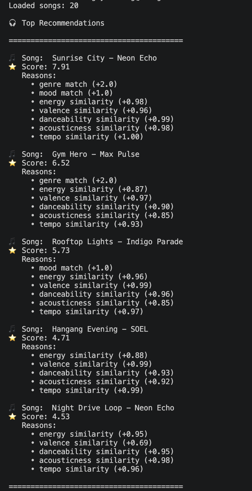
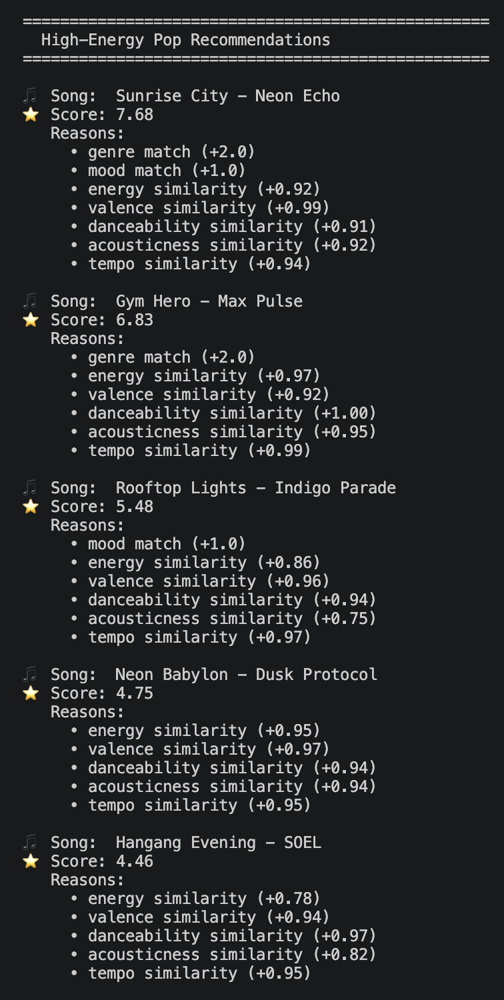
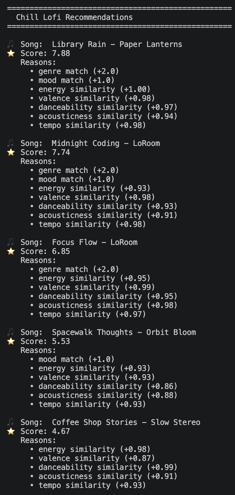
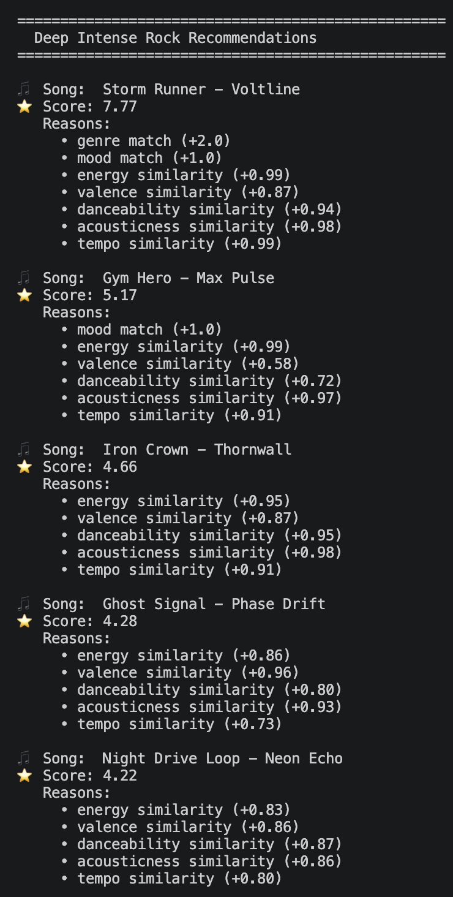
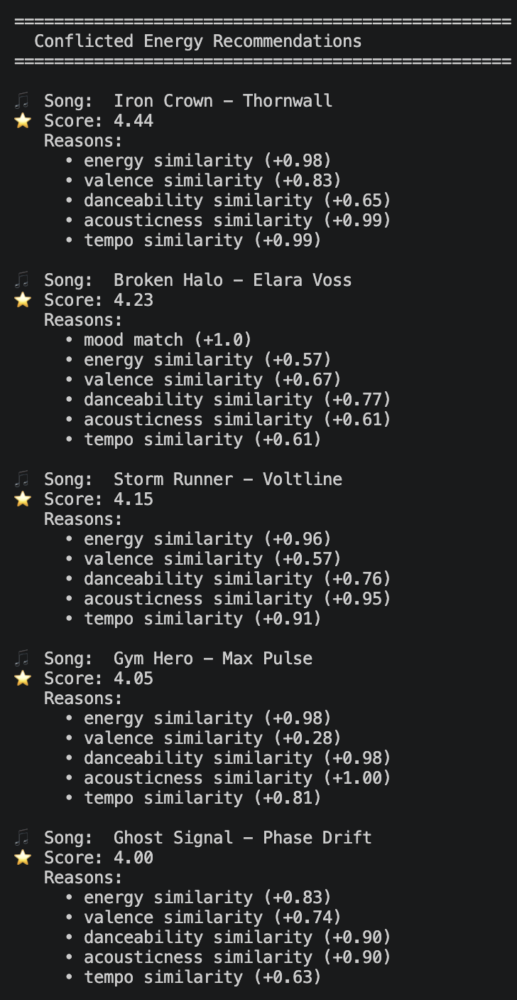
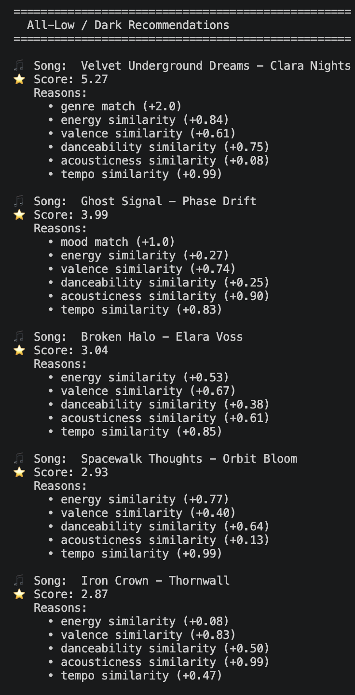
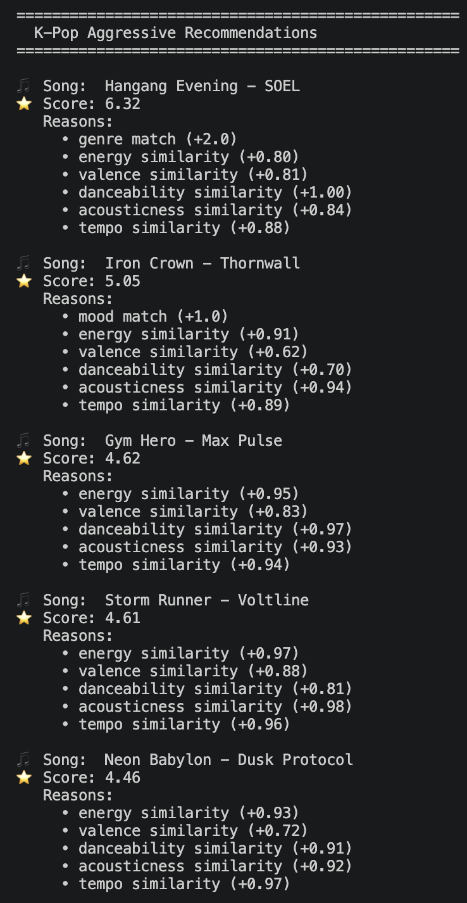

# 🎵 Music Recommender Simulation

## Project Summary

In this project you will build and explain a small music recommender system.

Your goal is to:

- Represent songs and a user "taste profile" as data
- Design a scoring rule that turns that data into recommendations
- Evaluate what your system gets right and wrong
- Reflect on how this mirrors real world AI recommenders

Replace this paragraph with your own summary of what your version does.

---

## How The System Works

Real-world recommendation systems like Spotify and YouTube use **hybrid recommendation systems** — combining two main approaches. **Collaborative filtering** looks at patterns in user behavior (likes, skips, playlists) and finds other users with similar habits to inform suggestions. **Content-based filtering** analyzes the actual properties of a song — energy, tempo, mood, danceability — and finds other songs with similar characteristics. These systems operate at massive scale, processing millions of interactions per second using machine learning models trained on billions of data points. They continuously update recommendations in real time, so the more you listen, the more personalized your feed becomes. Real systems also optimize for engagement metrics like watch time and retention, meaning recommendations are shaped not just by what you like but by what keeps you on the platform longest. This combination of behavioral signals and audio features is what makes modern recommenders feel surprisingly accurate at capturing your "vibe."

Our system takes a simpler but conceptually grounded approach. We implement a **content-based recommendation system** that generates recommendations by directly comparing each song's features to a stored user taste profile — no listening history needed. Every song is represented as a vector of numerical and categorical features (energy, valence, tempo, danceability, acousticness, genre, mood) that describe the "feel" of that track. To score a song, we compute how close its feature values are to the user's preferences using a **distance-based scoring function** that rewards closeness rather than just higher or lower values. Categorical features (genre and mood) are matched directly for a binary full-weight or zero contribution. All features are then combined into a normalized final score between 0 and 1.

### Algorithm Recipe

| Feature | Weight | How It's Scored |
|---|---|---|
| `genre` match | **2.0** | +2.0 if genre matches, +0 otherwise |
| `mood` match | **1.5** | +1.5 if mood matches, +0 otherwise |
| `energy` similarity | **1.0** | `1 - \|song - user\| / 1.0` × 1.0 |
| `valence` similarity | **1.0** | `1 - \|song - user\| / 1.0` × 1.0 |
| `danceability` similarity | **0.75** | `1 - \|song - user\| / 1.0` × 0.75 |
| `tempo_bpm` similarity | **0.75** | `1 - \|song - user\| / 120` × 0.75 |
| `acousticness` similarity | **0.5** | `1 - \|song - user\| / 1.0` × 0.5 |
| **Total max score** | **7.5** | Final score normalized to 0–1 range |

**Numerical similarity formula:** `similarity = 1 - (|song_value - user_value| / max_range)`
This rewards closeness — a song perfectly matching the user's preferred energy scores 1.0, while the maximum possible distance scores 0.0.

### Scoring vs. Ranking

**Scoring** assigns a compatibility number to each individual song in the catalog. **Ranking** is the final step — all scored songs are sorted in descending order and the **top K** are returned as recommendations. Scoring answers *"how compatible is this song?"* Ranking answers *"which songs are best relative to each other?"*

See the full system flowchart: [docs/system_flowchart.md](docs/system_flowchart.md)

### Sample Output



### Limitations and Bias

- The high genre weight (2.0) means a song with a different genre label but nearly identical energy, mood, and tempo will rank much lower than it deserves — the system may miss great cross-genre matches.
- Users with niche preferences (e.g., classical or metal) will receive weaker recommendations from a catalog that underrepresents those genres, since the genre match bonus is rarely triggered.
- All features are treated as independent — the system doesn't capture combined signals like "high energy AND high acousticness" (typical of live recordings), so those combinations may be scored misleadingly.

---

## Features Used in This Simulation

### Song Object Features

- `genre` — the musical category of the song (e.g. pop, hip-hop, jazz)
- `mood` — the emotional tone of the song (e.g. happy, melancholic, aggressive)
- `energy` — a 0–1 score reflecting intensity and activity level
- `tempo_bpm` — the speed of the song in beats per minute (realistic range: 60–180)
- `valence` — a 0–1 score reflecting musical positivity (high = upbeat, low = somber)
- `danceability` — a 0–1 score reflecting how suitable the song is for dancing
- `acousticness` — a 0–1 score reflecting how acoustic (vs. electronic) the song sounds

### UserProfile Features

- `preferred_genre` — the user's favorite musical genre
- `preferred_mood` — the emotional tone the user currently prefers
- `preferred_energy` — the user's preferred energy level (0–1)
- `preferred_tempo` — the user's preferred song speed in BPM
- `preferred_valence` — the user's preferred positivity/mood tone (0–1)
- `preferred_danceability` — the user's preferred danceability level (0–1)
- `preferred_acousticness` — the user's preference for acoustic vs. electronic sound (0–1)

---

## Getting Started

### Setup

1. Create a virtual environment (optional but recommended):

   ```bash
   python -m venv .venv
   source .venv/bin/activate      # Mac or Linux
   .venv\Scripts\activate         # Windows

2. Install dependencies

```bash
pip install -r requirements.txt
```

3. Run the app:

```bash
python -m src.main
```

### Running Tests

Run the starter tests with:

```bash
pytest
```

You can add more tests in `tests/test_recommender.py`.

---

## Experiments You Tried

Use this section to document the experiments you ran. For example:

- What happened when you changed the weight on genre from 2.0 to 0.5
- What happened when you added tempo or valence to the score
- How did your system behave for different types of users

### Terminal Output Screenshots

**High-Energy Pop**


**Chill Lofi**


**Deep Intense Rock**


**Conflicted Energy (adversarial)**


**All-Low / Dark (adversarial)**


**K-Pop Aggressive (adversarial)**


---

## Limitations and Risks

Summarize some limitations of your recommender.

Examples:

- It only works on a tiny catalog
- It does not understand lyrics or language
- It might over favor one genre or mood

You will go deeper on this in your model card.

---

## Reflection

Read and complete `model_card.md`:

[**Model Card**](model_card.md)

Write 1 to 2 paragraphs here about what you learned:

- about how recommenders turn data into predictions
- about where bias or unfairness could show up in systems like this


---

## 7. `model_card_template.md`

Combines reflection and model card framing from the Module 3 guidance. :contentReference[oaicite:2]{index=2}  

```markdown
# 🎧 Model Card - Music Recommender Simulation

## 1. Model Name

Give your recommender a name, for example:

> VibeFinder 1.0

---

## 2. Intended Use

- What is this system trying to do
- Who is it for

Example:

> This model suggests 3 to 5 songs from a small catalog based on a user's preferred genre, mood, and energy level. It is for classroom exploration only, not for real users.

---

## 3. How It Works (Short Explanation)

Describe your scoring logic in plain language.

- What features of each song does it consider
- What information about the user does it use
- How does it turn those into a number

Try to avoid code in this section, treat it like an explanation to a non programmer.

---

## 4. Data

Describe your dataset.

- How many songs are in `data/songs.csv`
- Did you add or remove any songs
- What kinds of genres or moods are represented
- Whose taste does this data mostly reflect

---

## 5. Strengths

Where does your recommender work well

You can think about:
- Situations where the top results "felt right"
- Particular user profiles it served well
- Simplicity or transparency benefits

---

## 6. Limitations and Bias

Where does your recommender struggle

Some prompts:
- Does it ignore some genres or moods
- Does it treat all users as if they have the same taste shape
- Is it biased toward high energy or one genre by default
- How could this be unfair if used in a real product

---

## 7. Evaluation

How did you check your system

Examples:
- You tried multiple user profiles and wrote down whether the results matched your expectations
- You compared your simulation to what a real app like Spotify or YouTube tends to recommend
- You wrote tests for your scoring logic

You do not need a numeric metric, but if you used one, explain what it measures.

---

## 8. Future Work

If you had more time, how would you improve this recommender

Examples:

- Add support for multiple users and "group vibe" recommendations
- Balance diversity of songs instead of always picking the closest match
- Use more features, like tempo ranges or lyric themes

---

## 9. Personal Reflection

A few sentences about what you learned:

- What surprised you about how your system behaved
- How did building this change how you think about real music recommenders
- Where do you think human judgment still matters, even if the model seems "smart"

