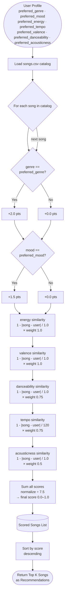

# Music Recommender System — Flowchart

## Notes

- **Max possible score before normalization:** 7.5
- **Categorical features** (genre, mood) are binary: full weight or zero.
- **Numerical features** use distance-based similarity — closer to user preference = higher score.
- **Tempo max range** is 120 (covers the realistic 60–180 BPM span).
- **K** is a configurable parameter (default: top 3 or top 5 recommendations).
